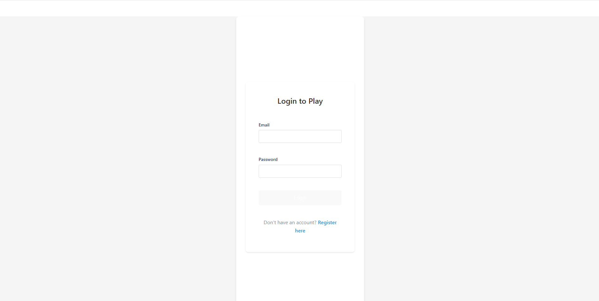

  
  # King me (Checkers vs AI)

## Description

This is a full stack website that is integreting AI vs a user playing a game of checkers.

Initially, when you open the website, you are going to be prompted with a homescreen that gives you three options: either Login, Create Account, or Game Rules . If you click on the Login to Play button; it is going to direct you into a login screen where you put your credentials in to login. If it is your first time on the website you are going to click the Create Account button where you will create your account. Once you have signed up, or you have already done this a previous time; you will now login and wil be redirected to another page. If you choose the Game Rules button you will be directed to a rules page that explains all of the rules of checkers. Once you have logged in you will be sent to the  game page where you will see the checkers board and be able to play a game of checkers vs AI. You are the red pieces and the AI is the black pieces; you will start off by moving a checkers piece anywhere you want on the board and then the AI will next choose a piece after that. The game will go on with the user and AI going back and forth in a game of checkers.

## Table of Contents 

If your README is long, add a table of contents to make it easy for users to find what they need.

- [Description](#description)
- [Deployed Application](#deployed-application)
- [Installation](#installation)
- [Future Plans](#future-plans)
- [User Stories](#overall-user-story)
- [Screenshots](#screenshots)
- [License](#MIT)
- [Credits](#credits)

## Deployed Application
http://ourlinkhere

## Installation
-open terminal
- cd into client
-npm install
-npm run dev

-open another terminal
-cd into server
-npm install
-npm run start

## Future Plans
-
-
-

## Overall User Story:
AS A user
I WANT to login
SO THAT I can play a game of checkers vs AI

## User Story #2
AS A user
I WANT to click Create account
SO THAT I am prompted to a create account page that allows me to create an account

## User Story #3
AS A user
I WANT to click on Login so that I can put my credentials 

## User Story #4
AS A user 
I WANT to click on game rules
SO THAT I can be shown the rules of the game

## Screenshots
### Home page

### login page

### Create Account page

### Game page

### Rules page

## Credits
- Matt Chance
- Michael Fleming
- Justin Silber

## MIT License
Here is the link to your license:"https://opensource.org/license/MIT"

